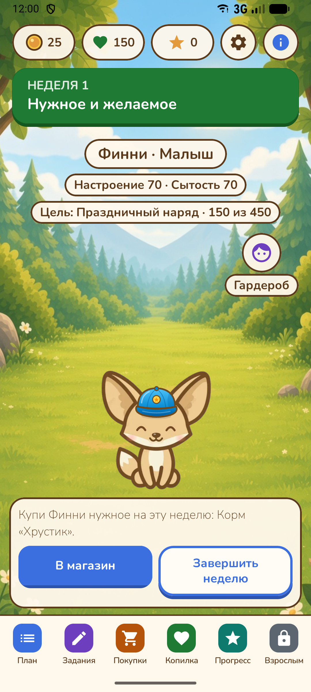
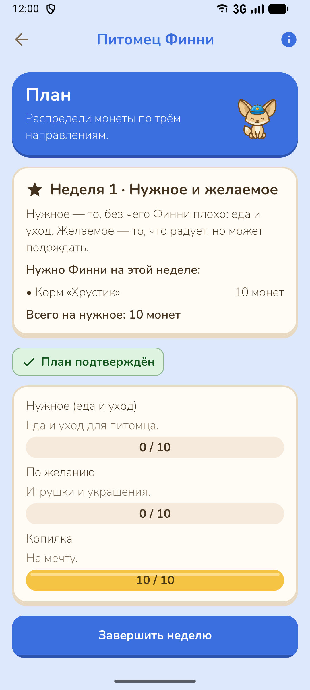
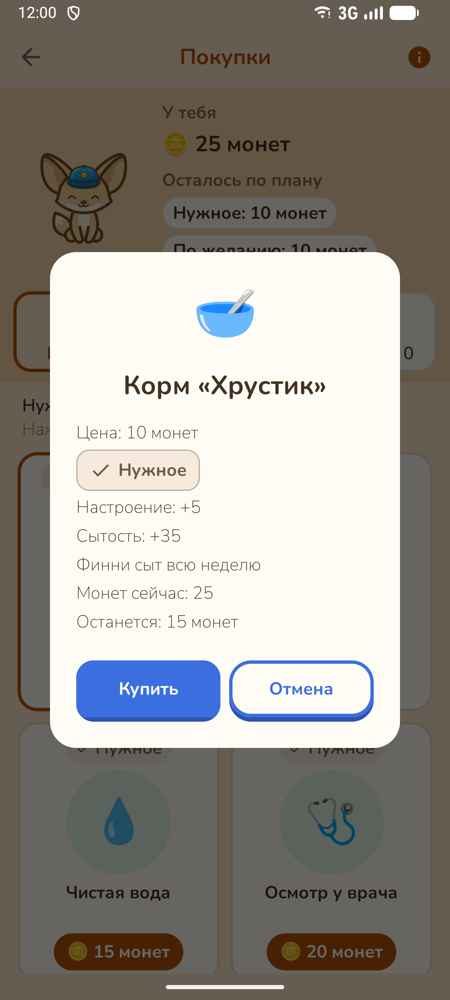
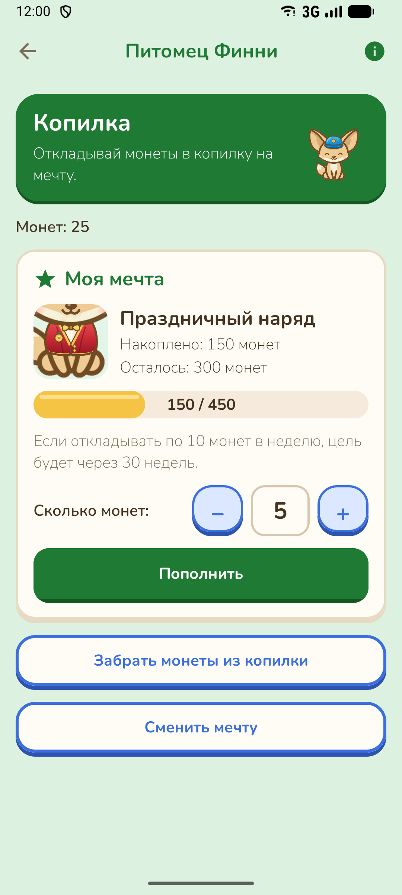
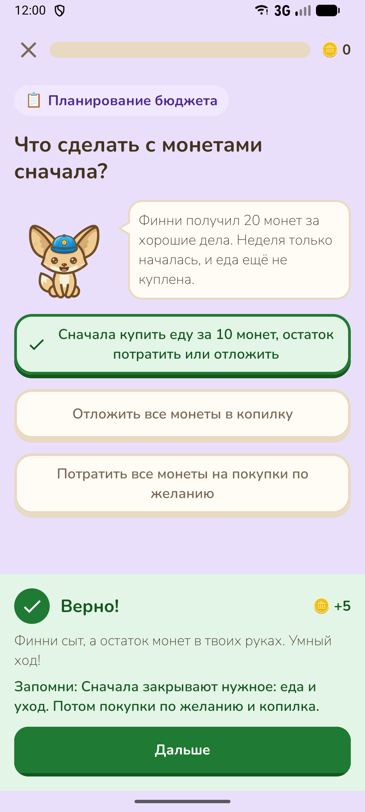
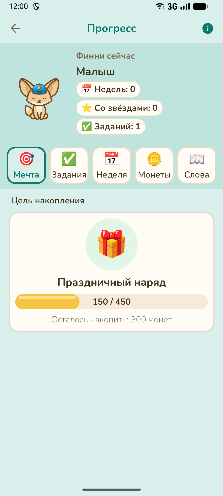

# Черновик карточки RuStore

Черновик для конкурсной сдачи (раздел 3.3 ТЗ). Публикация на этапе конкурса не требуется.

## Основное

| Поле | Значение |
|---|---|
| Название | Питомец Финни |
| Package name | `ru.finny.petgame` |
| Версия | 1.0 (versionCode 1) |
| Категория | Образование (дополнительно: Детям) |
| Возрастная маркировка | 0+ |
| Стоимость | Бесплатно, без рекламы и встроенных покупок |
| Иконка 512 × 512 | `app/src/main/res/mipmap-hdpi/icon.png` (PNG, 512 × 512) |

## Краткое описание

> Заботься о феньке Финни и учись планировать деньги: нужное, желаемое и копилка.

## Полное описание

> «Питомец Финни» — игра о первых деньгах для детей 7–11 лет.
>
> Финни — маленький фенёк, о котором заботится ребёнок. Каждую неделю Финни получает карманные
> монеты. Ребёнок сам решает, сколько потратить на нужное (еду и уход), сколько на желаемое
> (игрушки и украшения) и сколько отложить в копилку на мечту.
>
> Что внутри:
> • План недели: распредели монеты на три части и сравни план с тем, что вышло на самом деле.
> • Магазин: перед покупкой видно цену, категорию и то, как покупка порадует Финни.
> • Копилка: выбери мечту — клумбу, домик, змея, горку, качели или праздничный наряд — и смотри,
>   сколько осталось копить.
> • Задания: короткие жизненные ситуации про бюджет, покупки и сбережения с объяснением после
>   каждого ответа.
> • Рост: за разумные решения Финни получает звёздочки и растёт из малыша во взрослого.
> • Раздел для взрослого: цели приложения и прогресс ребёнка без оценок.
>
> Ошибки не наказываются: Финни не болеет и не исчезает, а приложение подсказывает, как
> исправить ситуацию на следующей неделе.
>
> Монеты в игре не настоящие: их нельзя купить, продать или обменять. В приложении нет рекламы,
> покупок, регистрации и интернета. Все данные хранятся только на устройстве.

## Скриншоты

Версия 1.0, светлая тема, портрет 1080 × 2400 (эмулятор Android Studio Medium Phone). Файлы лежат
в `docs/rustore/screenshots/`.

| № | Экран | Файл |
|---|---|---|
| 1 | Главный экран: питомец, монеты, копилка и текущая цель | `01-main.png` |
| 2 | План недели: нужное, желаемое и копилка, план и факт | `02-plan.png` |
| 3 | Магазин: подтверждение покупки с ценой, категорией и остатком | `03-shop.png` |
| 4 | Копилка: мечта, прогресс и срок накопления | `04-savings.png` |
| 5 | Задание: ответ и объяснение, почему он верный | `05-task.png` |
| 6 | Прогресс: стадия роста Финни и цель накопления | `06-progress.png` |

  
  
  
  
  
  

## Обоснование возрастной маркировки 0+

- Нет насилия, страшных сцен, грубой лексики и тем 6+ и старше: питомец не болеет, не
  получает травм и не исчезает.
- Нет рекламы, встроенных покупок, платных подписок и механик случайной награды.
- Игровая валюта не имеет реальной стоимости и не обменивается на деньги или призы.
- Нет чатов, общения между пользователями и публикации контента.
- Нет регистрации, сбора персональных данных и доступа в интернет.
- Внешних ссылок в детской части нет.

Контент рассчитан на детей 7–11 лет, но не содержит ничего, что требовало бы ограничения по
возрасту, поэтому выбрана маркировка 0+.

## Контакты разработчика и политика конфиденциальности

*Заполнить перед публикацией.*

| Поле | Значение |
|---|---|
| Разработчик (команда) | _указать_ |
| Электронная почта для связи | _указать_ |
| Сайт или страница проекта (необязательно) | _указать_ |
| Ссылка на политику конфиденциальности | _указать_ |

Для политики конфиденциальности достаточно указать, что
приложение не собирает и не передаёт данные; игровые данные хранятся локально и удаляются
сбросом профиля или удалением приложения.
